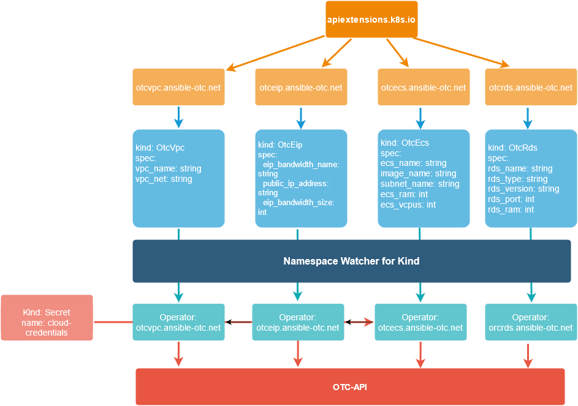

K8S Operator for ansible-otc
============================

This is the Ansible based [K8S Operator](https://kubernetes.io/docs/concepts/extend-kubernetes/operator/) for [ansible-otc](github.com/eumel8/ansible-otc). Following the [Operator Quickstart](https://sdk.operatorframework.io/docs/ansible/quickstart/) it's easy to generate a Ansible based Operator for Kubernetes:

```
operator-sdk new ansible-otc-operator --git-init --type ansible --generate-playbook --kind OtcEcs --api-version ansible-otc.net/v1
```

This will generate most of the content in this repo. The approach is to run Ansible inside Kubernetes and provide resource definitions in Kubernetes API back to the user like this:

```
kubectl -n ansible get otcecs
NAME       AGE
otcecs     28m
otcecs01   110s
```

in detail:

```
# kubectl -n ansible get otcecs otcecs -o yaml
apiVersion: ansible-otc.net/v1
kind: OtcEcs
metadata:
  annotations:
    kubectl.kubernetes.io/last-applied-configuration: |
      {"apiVersion":"ansible-otc.net/v1","kind":"OtcEcs","metadata":{"annotations":{},"name":"otcecs","namespace":"ansible"},"spec":{"availability_zone":"eu-de-01","ecs_adminkey":"ansible-otc-operator","ecs_name":"ansible-otc-operator","ecs_publicip":"0.0.0.0","ecs_ram":"2048","ecs_vcpus":"2","ecs_volumesize":12,"ecs_volumetype":"SATA","eip_bandwidth_name":"ansible-otc-operator","eip_bandwidth_size":"500","evs_availability_zone":"eu-de-01","evs_multiattach":false,"evs_scsi":false,"image_name":"Standard_Ubuntu_18.04_latest","keypair_file":"/key-file/ansible-operator.key.pub","localaction":"list","public_ip_address":"0.0.0.0","secgroups":["ansible-otc-operator"],"securitygroups":{"ansible-otc-operator":["ingress;IPv4;0;;;0.0.0.0/0","egress;IPv4;0;;;0.0.0.0/0"]},"subnet_dhcp_enable":"true","subnet_gateway":"10.0.0.1","subnet_name":"ansible-otc-operator","subnet_net":"10.0.0.0/26","subnet_primary_dns":"100.125.4.25","subnet_secondary_dns":"8.8.8.8","vpc_name":"ansible-otc-operator","vpc_net":"10.0.0.0/16"}}
  creationTimestamp: "2020-07-08T21:15:22Z"
  generation: 1
  managedFields:
  - apiVersion: ansible-otc.net/v1
    fieldsType: FieldsV1
    fieldsV1:
      f:metadata:
        f:annotations:
          .: {}
          f:kubectl.kubernetes.io/last-applied-configuration: {}
      f:spec:
        .: {}
        f:availability_zone: {}
        f:ecs_adminkey: {}
        f:ecs_name: {}
        f:ecs_publicip: {}
        f:ecs_ram: {}
        f:ecs_vcpus: {}
        f:ecs_volumesize: {}
        f:ecs_volumetype: {}
        f:eip_bandwidth_name: {}
        f:eip_bandwidth_size: {}
        f:evs_availability_zone: {}
        f:evs_multiattach: {}
        f:evs_scsi: {}
        f:image_name: {}
        f:keypair_file: {}
        f:localaction: {}
        f:public_ip_address: {}
        f:secgroups: {}
        f:securitygroups:
          .: {}
          f:ansible-otc-operator: {}
        f:subnet_dhcp_enable: {}
        f:subnet_gateway: {}
        f:subnet_name: {}
        f:subnet_net: {}
        f:subnet_primary_dns: {}
        f:subnet_secondary_dns: {}
        f:vpc_name: {}
        f:vpc_net: {}
    manager: kubectl
    operation: Update
    time: "2020-07-08T21:15:22Z"
  - apiVersion: ansible-otc.net/v1
    fieldsType: FieldsV1
    fieldsV1:
      f:status:
        .: {}
        f:conditions: {}
    manager: ansible-operator
    operation: Update
    time: "2020-07-08T21:15:41Z"
  name: otcecs
  namespace: ansible
  resourceVersion: "2608884"
  selfLink: /apis/ansible-otc.net/v1/namespaces/ansible/otcecs/otcecs
  uid: f50857be-d274-46f4-a50c-38599488ccd9
spec:
  availability_zone: eu-de-01
  ecs_adminkey: ansible-otc-operator
  ecs_name: ansible-otc-operator
  ecs_publicip: 0.0.0.0
  ecs_ram: "2048"
  ecs_vcpus: "2"
  ecs_volumesize: 12
  ecs_volumetype: SATA
  eip_bandwidth_name: ansible-otc-operator
  eip_bandwidth_size: "500"
  evs_availability_zone: eu-de-01
  evs_multiattach: false
  evs_scsi: false
  image_name: Standard_Ubuntu_18.04_latest
  keypair_file: /key-file/ansible-operator.key.pub
  localaction: list
  public_ip_address: 0.0.0.0
  secgroups:
  - ansible-otc-operator
  securitygroups:
    ansible-otc-operator:
    - ingress;IPv4;0;;;0.0.0.0/0
    - egress;IPv4;0;;;0.0.0.0/0
  subnet_dhcp_enable: "true"
  subnet_gateway: 10.0.0.1
  subnet_name: ansible-otc-operator
  subnet_net: 10.0.0.0/26
  subnet_primary_dns: 100.125.4.25
  subnet_secondary_dns: 8.8.8.8
  vpc_name: ansible-otc-operator
  vpc_net: 10.0.0.0/16
status:
  conditions:
  - ansibleResult:
      changed: 0
      completion: 2020-07-08T21:15:41.456689
      failures: 0
      ok: 25
      skipped: 9
    lastTransitionTime: "2020-07-08T21:15:33Z"
    message: Awaiting next reconciliation
    reason: Successful
    status: "True"
    type: Running

```

This is an example how to deploy an ECS in OTC with all required resources. 




CRDs are expand to the services

* vpc

* subnet

* secgroup

* eip

* keypair

* ecs

Configuration variables like in [otc\_vpc](https://github.com/eumel8/otc_vpc), [otc\_ecs](https://github.com/eumel8/otc_ecs), [and so on](https://ansible-otc.readthedocs.io).


Prerequisites:
--------------

Generate a ssh key pair for upload to OTC and inject in the ECS instance

```
ssh-keygen -q -N '' -f ansible-operator.key
```

Quickstart:
-----------


Connect to a Kubernetes Cluster and create a namespace

```
kubectl create namespace ansible
```

Create a secret with OTC credentials

```
kubectl create secret generic cloud-credentials -n ansible \
  --from-literal=OS\_PROJECT\_NAME=eu-de \
  --from-literal=OS\_REGION\_NAME=eu-de \
  --from-literal=OS\_AUTH\_URL=https://iam.eu-de.otc.t-systems.com:443/v3 \
  --from-literal=OS\_IDENTITY\_API\_VERSION=3 \
  --from-literal=OS\_USER\_DOMAIN\_NAME=OTC-EU-DE-xxxxxxxxxxxxxxxxx \
  --from-literal=OS\_USERNAME=xxxxxxx \
  --from-literal=OS\_PASSWORD=xxxxxxx
```

Create a secret with the ssh public key

```
kubectl -n ansible create secret generic key-file --from-file=ansible-operator.key.pub=./ansible-operator.key.pub
```

Apply the Custom Resource definitions

```
kubectl -n ansible apply -f deploy/crds/*crd.yaml
kubectl -n ansible apply -f deploy/crds/*cr.yaml
```

Apply the Operators:

```
kubectl -n ansible apply -f deploy/
```

Check installation

```
# kubectl -n ansible get all
NAME                                                READY   STATUS    RESTARTS   AGE
pod/ansible-otc-operator-secgroup-9f46996d6-s7shc   1/1     Running   0          46m
pod/ansible-otc-operator-keypair-69fdf58f5b-mw2vx   1/1     Running   0          46m
pod/ansible-otc-operator-subnet-7f8777b6-4dx8b      1/1     Running   0          46m
pod/ansible-otc-operator-eip-758df7bf4d-g8kvf       1/1     Running   0          46m
pod/ansible-otc-operator-vpc-55f8dbd9d4-7h9bz       1/1     Running   0          46m
pod/ansible-otc-operator-ecs-57b4bb87f7-82lsv       1/1     Running   0          30m

NAME                                            TYPE        CLUSTER-IP      EXTERNAL-IP   PORT(S)             AGE
service/ansible-otc-operatoro-ecs-metrics       ClusterIP   10.43.138.229   <none>        8383/TCP,8686/TCP   46m
service/ansible-otc-operator-subnet-metrics     ClusterIP   10.43.70.120    <none>        8383/TCP,8686/TCP   46m
service/ansible-otc-operator-secgroup-metrics   ClusterIP   10.43.211.139   <none>        8383/TCP,8686/TCP   46m
service/ansible-otc-operator-eip-metrics        ClusterIP   10.43.131.11    <none>        8383/TCP,8686/TCP   46m
service/ansible-otc-operator-keypair-metrics    ClusterIP   10.43.251.77    <none>        8383/TCP,8686/TCP   46m
service/ansible-otc-operator-vpc-metrics        ClusterIP   10.43.6.86      <none>        8383/TCP,8686/TCP   46m

NAME                                            READY   UP-TO-DATE   AVAILABLE   AGE
deployment.apps/ansible-otc-operator-secgroup   1/1     1            1           46m
deployment.apps/ansible-otc-operator-keypair    1/1     1            1           46m
deployment.apps/ansible-otc-operator-subnet     1/1     1            1           46m
deployment.apps/ansible-otc-operator-eip        1/1     1            1           46m
deployment.apps/ansible-otc-operator-vpc        1/1     1            1           46m
deployment.apps/ansible-otc-operator-ecs        1/1     1            1           46m

NAME                                                      DESIRED   CURRENT   READY   AGE
replicaset.apps/ansible-otc-operator-secgroup-9f46996d6   1         1         1       46m
replicaset.apps/ansible-otc-operator-keypair-69fdf58f5b   1         1         1       46m
replicaset.apps/ansible-otc-operator-subnet-7f8777b6      1         1         1       46m
replicaset.apps/ansible-otc-operator-eip-758df7bf4d       1         1         1       46m
replicaset.apps/ansible-otc-operator-vpc-55f8dbd9d4       1         1         1       46m
replicaset.apps/ansible-otc-operator-ecs-57b4bb87f7       1         1         1       46m

```

The first job is already runnung in the ansible-otc-operator POD. It's a simple list of resource, so you can check connectivity. Normaly a description of the resources will made in the CRD, so you have a kind of API description.

Next is a full example to deploy a ECS. This will require VPC,Subnet,Secgroup, Keypair, and EIP. Adjust in example/ecs.yaml and ensure the resources are created before. Here only as example create of EIP:

```
kubectl -n ansible apply -f examples/eip.yaml
```

You can show the created resource. A `kubectl -n ansible patch otceips.otceip.ansible-otc.net otceip -p '{"spec": {"localaction": "show"}}'` will not work due the missing patch possibilty, so you can `kubectl -n ansible edit otceips.otceip.ansible-otc.net otceip` and change `localaction: create` to `localaction: show`. The output is in the corresponding EIP Operator POD.
The ip-address can you put in public_ip value of examples/ecs.yaml to use this ip-address in the next deployment:


```
kubectl -n ansible apply -f examples/ecs.yaml
```

You can check the output in ECS Operator POD log

Login into ECS

```
ssh -i ansible-operator.key ubuntu@<EIP>
```

That's all. No, that's not all. This is only an example how to use the Operator with Ansible in Open Telekom Cloud context.
With ECS creation we're on level 1 of 5 on [Operator Capability Levels](https://sdk.operatorframework.io/docs/operator-capabilities/). ansible-otc is task-driven and has no object-level approach. There is no app livecycle, monitoring or autopilot zp reach level 5. But you've got an insight and idea, hopefully :)

